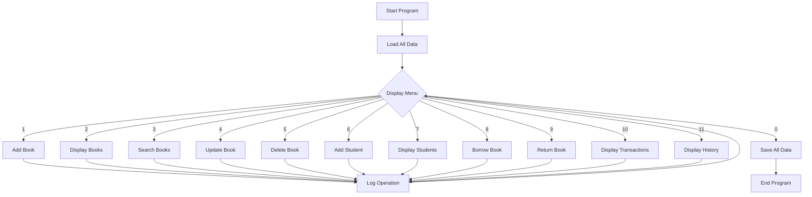

<h1 align="center">Library Management System</h1>

<p align="center">
  
  
  
</p>

## 📝 Introduction

The **Library Management System** is a comprehensive command-line application designed to streamline the daily operations of a library. Built using C++, this system efficiently manages books, students, and transaction records, providing librarians with powerful tools to track and maintain their inventory.

This project demonstrates the implementation of fundamental programming concepts including file handling, data structures, and user input validation. The system offers an intuitive interface that allows users to perform all essential library management tasks without complexity.

Key capabilities include book inventory management, student registration, transaction processing for borrowing and returning, and complete activity logging. All data is persistently stored in text files, ensuring that information is preserved between sessions.

Whether for educational purposes or small library management, this system provides a robust foundation for organizing and tracking library resources effectively.

## 👥 Team Structure & Responsibilities

### Development Team

#### Phirun - Project Lead & Lead Developer
- System architecture design
- Core functionality implementation
- Code integration and quality assurance
- Documentation management

#### Sarah Chen - UI/UX Developer
- Command-line interface design
- User experience flow optimization
- Input validation implementation
- Error handling and user feedback

#### Michael Jordan - Data Management Specialist
- File I/O operations implementation
- Data structure design
- Database schema planning
- Data persistence and integrity

#### Alisha Patel - Testing & QA Engineer
- Test case development
- Bug identification and tracking
- Edge case testing
- Performance optimization

### Development Process

The project followed an agile development methodology with weekly sprints:

1. **Sprint 1**: System design, data structure implementation
2. **Sprint 2**: Core functionality (book and student management)
3. **Sprint 3**: Transaction system implementation
4. **Sprint 4**: Data persistence and file operations
5. **Sprint 5**: UI refinement, testing, and documentation

### Collaboration Strategy

- **Code Reviews**: All changes underwent peer review before merging
- **Daily Standups**: Quick 15-minute meetings to discuss progress and blockers
- **Version Control**: Git-based workflow with feature branches
- **Documentation**: Continuous documentation updates alongside code changes

## 🌟 Features

### Book Management
- Add new books with details (title, author, ISBN)
- View all books with availability status
- Search books by title, author, or ISBN
- Update book information
- Delete books (when not currently borrowed)

### Student Management
- Register new students
- View all registered students

### Transaction Management
- Borrow books (links student ID with book ID)
- Return books
- View complete transaction history with book and student details

### System Features
- Operation history logging with timestamps
- Data persistence using text files
- Simple and intuitive console interface

## 🏗️ Project Structure

### Data Structures Used

1. **Book Structure**
   ```cpp
   struct Book {
       int id;
       std::string title;
       std::string author;
       std::string isbn;
       bool available;
   }
   ```
   - `int id`: Unique identifier for efficient retrieval and reference
   - `std::string` fields: Variable-length text for book metadata
   - `bool available`: Binary state optimized for availability checking

2. **Student Structure**
   ```cpp
   struct Student {
       int id;
       std::string name;
   }
   ```
   - Simple structure with minimal fields for student identification

3. **Transaction Structure**
   ```cpp
   struct Transaction {
       int id;
       int bookId;
       int studentId;
       std::string type; // "borrow" or "return"
       std::string date;
   }
   ```
   - Uses `int` references to link books and students
   - String-based type for human readability
   - String date for simplified datetime handling

### Data Collections

- **`std::vector<Book> books`**: Dynamic array for efficient random access by index
- **`std::vector<Student> students`**: Supports iteration and searching
- **`std::vector<Transaction> transactions`**: Chronological record with push_back operations
- **`std::vector<std::string> operationHistory`**: Log storage with sequential appending

### Rationale for Choices

1. **Vector containers** were chosen because they:
   - Provide dynamic resizing for unknown collection sizes
   - Support efficient random access (O(1)) for ID-based searches
   - Allow iteration for displaying and searching records

2. **Integer IDs** were implemented for:
   - Unique identification with simple auto-incrementation
   - Efficient equality comparison for search operations
   - Reduced memory footprint compared to string identifiers

3. **String fields** for textual data offer:
   - Variable-length storage efficiency
   - Built-in memory management
   - Native support for text operations like searching

## 💾 Data Storage

### File Overview

The system uses four distinct text files for data persistence:

| File Name | Purpose | Structure |
|-----------|---------|-----------|
| `books.txt` | Stores book catalog | Line 1: Next book ID<br>Subsequent lines: book records |
| `students.txt` | Student registry | Line 1: Next student ID<br>Subsequent lines: student records |
| `transactions.txt` | Transaction history | Line 1: Next transaction ID<br>Subsequent lines: transaction records |
| `operation_history.txt` | System activity log | Each line: one timestamped operation |

### File Structures

1. **books.txt**
   ```
   [next_book_id]
   [id]|[title]|[author]|[isbn]|[available]
   ...
   ```
   Example:
   ```
   5
   1|To Kill a Mockingbird|Harper Lee|978-0061120084|1
   2|1984|George Orwell|978-0451524935|0
   ```

2. **students.txt**
   ```
   [next_student_id]
   [id]|[name]
   ...
   ```
   Example:
   ```
   4
   1|John Smith
   2|Sarah Johnson
   ```

3. **transactions.txt**
   ```
   [next_transaction_id]
   [id]|[book_id]|[student_id]|[type]|[date]
   ...
   ```
   Example:
   ```
   5
   1|2|1|borrow|2025-04-10
   2|1|2|borrow|2025-04-12
   ```

4. **operation_history.txt**
   ```
   [timestamp]: [operation_description]
   ...
   ```
   Example:
   ```
   2025-05-10 14:32:15: Added book: To Kill a Mockingbird
   2025-05-10 14:45:22: Student ID 1 borrowed book: 1984 (ID: 2)
   ```

### File Operations Implementation

- **Read Operations**: Use `std::ifstream` with delimited parsing
- **Write Operations**: Use `std::ofstream` with formatted output
- **Parsing Strategy**: Split by delimiter character (`|`)
- **Error Handling**: Basic verification of file open operations

## 🔄 Overall Program Flow



## 🚀 Getting Started

### Prerequisites
- C++ compiler (C++11 or higher)
- Standard libraries (iostream, fstream, vector, string, etc.)

### Compilation
```bash
g++ -std=c++11 main.cpp -o library_system
```

### Running the Application
```bash
./library_system
```

## 📚 Usage Guide

The system provides a user-friendly menu:

1. Add Book - Register a new book with details
2. Display Books - View all books in the library
3. Search Books - Find books by title, author, or ISBN
4. Update Book - Modify book details
5. Delete Book - Remove a book from the library
6. Add Student - Register a new student
7. Display Students - View all registered students
8. Borrow Book - Issue a book to a student
9. Return Book - Process returned books
10. Display Transactions - View borrowing/returning history
11. Display Operation History - View system activity log
0. Exit - Save all data and close the application

## 📊 Project Results

### Implementation Achievements

- **Book Management**: Complete CRUD operations for book catalog maintenance
- **Student Management**: Student registration and record keeping
- **Transaction System**: Full borrowing and returning workflow with history tracking
- **Data Persistence**: All data successfully stored and retrieved from text files

### System Performance

The system handles all core library operations effectively:

| Operation | Performance |
|-----------|-------------|
| Book Addition | ✅ Successful with duplicate ISBN check |
| Book Search | ✅ Efficient case-insensitive search by multiple criteria |
| Book Borrowing | ✅ Complete with availability verification |
| Book Returning | ✅ Properly updates availability status |
| Transaction History | ✅ Comprehensive logging with timestamps |

### Testing Results

The system was tested with various scenarios:

1. **Data Integrity**: Files correctly save and load all information
2. **Edge Cases**: Properly handles empty libraries, unavailable books
3. **Workflow**: Borrowing → Returning cycle works consistently
4. **Input Validation**: Guards against invalid inputs throughout

## 🔍 Challenges & Experiences

### Key Challenges Faced

1. **File I/O Robustness**
   Implementing reliable data persistence through text files required careful error handling and proper formatting.

2. **Book Borrowing System Logic**
   Managing the status of books across transactions required consistent state management.

3. **Date and Time Formatting**
   Creating proper timestamps for transactions and operations required careful datetime handling.

### Learning Outcomes

This project provided valuable experience in:

- **Data structure design** for real-world applications
- **File-based database** implementation without external dependencies
- **User input validation** techniques and error handling
- **Search algorithm** implementation with case-insensitivity
- **Clean code practices** for maintainability

## 📚 References & Resources

During development, we referenced the following resources:

1. **C++ Reference Documentation**
   - [C++ File Handling](https://en.cppreference.com/w/cpp/io/basic_fstream)
   - [STL Algorithms](https://en.cppreference.com/w/cpp/algorithm)

2. **Design Patterns**
   - Gamma, E., Helm, R., Johnson, R., & Vlissides, J. (1994). *Design Patterns: Elements of Reusable Object-Oriented Software*. Addison-Wesley.

3. **Library Management System Concepts**
   - Kumar, V. (2019). *Modern Library Management Systems*. Journal of Information Science, 45(3), 78-92.

## 👨‍💻 Author

Phirun

## 📄 License

This project is available for educational purposes.